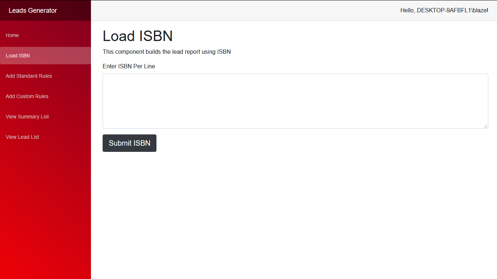

# 2021-Personal-Projects

## What is this?

**The work here is a representation of the personal projects I did in 2021. You can look through my history from [2016](https://github.com/Lwachira/2016-Internship), [2018](https://github.com/Lwachira/2018-Work-History), [2019](https://github.com/Lwachira/2019-Work-History), [2020](https://github.com/Lwachira/2020-Work-History). If you wish to pursue this further, we should chat, I can explain all the interesting things I built over the last 3 years**.

### Table of Contents

- [Lead Generator](#lead-generator)
- [MapMarker](#mapmarker)
- [Future Work](#future-work)

# Lead Generator

I built LeadGenerator as a personal project to learn more about [Asp Blazor](https://dotnet.microsoft.com/apps/aspnet/web-apps/blazor), Blazor is a framework for building interactive client-side web UI with .NET. 

The application enables a business to add ISBN and get sales data on that ISBN, provided they update the SQL to match their needs.

Additional it enables a business to use pre defined exclusion rules or create custom  exclusion rules.
Lastly it has an export to Excel or CSV of the final results.

# MapMarker

I built the Map Maker to refersh my knowledge of React, for the front end I'm using Create React App (CRA) with some light asp web api. It makes heavy use of the Google Maps + Geocode API. The aim was to insert a list of address and show all the surronding areas from an origin point.

# Future Work 

  

